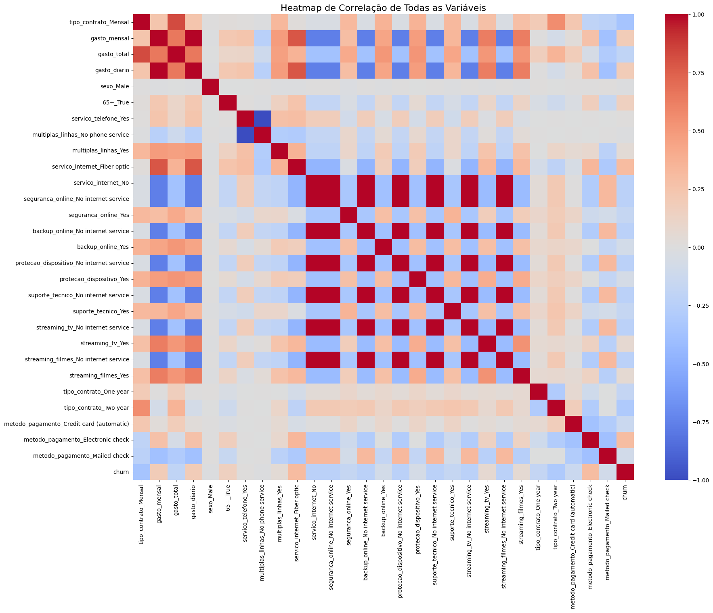

# DESAFIO ALURA ONE (DATA SCIENCE) - TelecomX BR parte 2

# Projeto de Previsão de Churn para TelecomX BR

## Visão Geral

Este projeto apresenta uma solução de ponta a ponta para o problema de previsão de evasão de clientes (churn) em uma empresa de telecomunicações. O objetivo é identificar os clientes com maior probabilidade de cancelar seus serviços, entender os principais fatores que motivam essa decisão e fornecer um modelo de machine learning pronto para ser implementado.

O pipeline desenvolvido inclui análise exploratória de dados, pré-processamento, treinamento de modelos, otimização de hiperparâmetros e, finalmente, a serialização do modelo final para uso em produção.

## Estrutura do Projeto

- **/dados_tratados.csv**: O conjunto de dados original utilizado para análise e treinamento.
- **/Desafio_TelecomX_BR2_André_Frischlander.ipynb**: Notebook Jupyter contendo todo o processo de análise, modelagem e avaliação.
- **/random_forest_churn_pipeline.pkl**: O pipeline final treinado, contendo o pré-processador e o modelo Random Forest otimizado.
- **/README.md**: Este documento.

## Pré-processamento e Análise Exploratória de Dados (EDA)

A análise dos dados foi executada de forma competente. A etapa de EDA identificou corretamente a distribuição da variável-alvo ('churn'), revelando um desbalanceamento de classes (aproximadamente 27% de churn), um fator crítico para a modelagem. A conversão de variáveis categóricas para numéricas e a normalização das features foram realizadas adequadamente, preparando o terreno para a modelagem.

## Fatores de Influência na Evasão (Feature Importance)

A análise de correlação e a extração de feature importance do modelo Random Forest foram consistentes e apontaram para um perfil claro do cliente propenso à evasão. Os fatores mais determinantes, em ordem de importância, são:

Duração do Contrato (meses_de_contrato): A variável com maior poder preditivo negativo. A lealdade do cliente, medida em meses, é o fator mais forte de retenção.

Valor Total Gasto (gasto_total): Correlacionado com a duração, indica que clientes com maior valor de vida (LTV) são menos propensos à evasão.

Valor Mensal (gasto_mensal): Possui uma correlação positiva com o churn, sugerindo que cobranças mensais elevadas aumentam o risco de cancelamento.

Tipo de Contrato (tipo_contrato_Month-to-month): O fator categórico mais forte. A ausência de um vínculo de longo prazo é um catalisador para a evasão.

Serviço de Internet (servico_internet_Fiber optic): Clientes com fibra óptica demonstraram maior propensão ao churn, o que pode indicar problemas de precificação, concorrência ou qualidade percebida neste serviço.

Método de Pagamento (metodo_pagamento_Electronic check): Um indicador surpreendentemente forte de risco de churn.



## Modelo Final

A escolha do Random Forest Otimizado como o modelo de produção se justifica pelos seguintes motivos:

Robustez e Generalização: Modelos baseados em árvores, como o Random Forest, são menos sensíveis a outliers e à escala das features. A otimização via GridSearchCV garante que o modelo foi ajustado para oferecer o melhor desempenho possível no espectro de seus hiperparâmetros, resultando em um bom equilíbrio entre viés e variância.

Interpretabilidade Superior (Feature Importance): A capacidade do Random Forest de calcular a importância de cada variável é fundamental para traduzir os resultados do modelo em insights de negócio acionáveis. A clareza sobre quais fatores mais impulsionam o churn é tão valiosa quanto a própria previsão.

Performance Equilibrada: Enquanto a Regressão Logística obteve um recall altíssimo, sua precisão foi mais baixa. O Random Forest Otimizado oferece um balanço mais pragmático para o negócio, garantindo que os esforços de retenção sejam focados em um grupo de clientes com alta probabilidade de churn, sem desperdiçar recursos excessivos em falsos positivos.

## Estratégias de Retenção Propostas

Com base nos fatores de churn identificados, as seguintes estratégias são recomendadas:

Estratégia 1 (Foco em Contratos): Implementar uma política de incentivo para a migração de clientes de contratos mensais para planos anuais ou bianuais. Oferecer descontos progressivos ou benefícios exclusivos pode aumentar a barreira de saída.

Estratégia 2 (Análise de Serviço e Preço): Realizar uma investigação aprofundada sobre a causa da alta taxa de churn em clientes de Fibra Óptica. Isso pode envolver pesquisas de satisfação, análise de concorrência e revisão da estrutura de preços para este serviço.

Estratégia 3 (Otimização de Pagamentos): Incentivar a adoção de métodos de pagamento automáticos (cartão de crédito, débito automático) em detrimento do cheque eletrônico, oferecendo pequenos descontos ou benefícios, visando criar um vínculo de menor atrito com o cliente.

Estratégia 4 (Ação Proativa com o Modelo): Utilizar o pipeline do modelo salvo (.pkl) para criar um sistema de scoring periódico (semanal/mensal). Este sistema deve gerar uma lista de clientes com a maior probabilidade de churn, permitindo que a equipe de retenção entre em contato proativamente com ofertas personalizadas, suporte técnico ou pesquisas de satisfação.

## Como Executar o Projeto

### Pré-requisitos

- Python 3.8+
- Bibliotecas: pandas, scikit-learn, matplotlib, seaborn.

É recomendado criar um ambiente virtual para instalar as dependências.

```bash
python -m venv venv
source venv/bin/activate  # No Windows: venv\Scripts\activate
```

Instalação
Clone este repositório e instale as dependências necessárias:

```bash
git clone [https://github.com/seu-usuario/seu-repositorio.git](https://github.com/seu-usuario/seu-repositorio.git)
cd seu-repositorio
pip install pandas scikit-learn matplotlib seaborn
```

Executando a Análise
Para explorar todo o processo de análise e modelagem, abra e execute o notebook Jupyter:

```Bash
jupyter notebook Desafio_TelecomX_BR2_André_Frischlander.ipynb
```

Usando o Modelo Treinado para Previsões
O pipeline final já está treinado e salvo no arquivo random_forest_churn_pipeline.pkl. Para fazer uma previsão em novos dados, você pode usar o seguinte script como exemplo:
````bash
import pandas as pd
import pickle

# Carregar o pipeline salvo
with open('random_forest_churn_pipeline.pkl', 'rb') as file:
    loaded_pipeline = pickle.load(file)

# Exemplo de um novo cliente (deve ter a mesma estrutura do dataset original)
novo_cliente = pd.DataFrame({
    'sexo': ['Male'],
    '65+': [False],
    'parceiro': [True],
    'dependentes': [False],
    'meses_de_contrato': [1],
    'servico_telefone': ['Yes'],
    'multiplas_linhas': ['No'],
    'servico_internet': ['Fiber optic'],
    'seguranca_online': ['No'],
    'backup_online': ['No'],
    'protecao_dispositivo': ['No'],
    'suporte_tecnico': ['No'],
    'streaming_tv': ['No'],
    'streaming_filmes': ['No'],
    'tipo_contrato': ['Month-to-month'],
    'faturamento_sem_papel': [True],
    'metodo_pagamento': ['Electronic check'],
    'gasto_mensal': [70.70],
    'gasto_total': [70.70],
    'gasto_diario': [2.35]
})

# Fazer a previsão (1 = Churn, 0 = Não Churn)
previsao = loaded_pipeline.predict(novo_cliente)
probabilidades = loaded_pipeline.predict_proba(novo_cliente)

print(f"Previsão de Churn: {previsao[0]}")
print(f"Probabilidade de Churn: {probabilidades[0][1]:.2%}")
````
